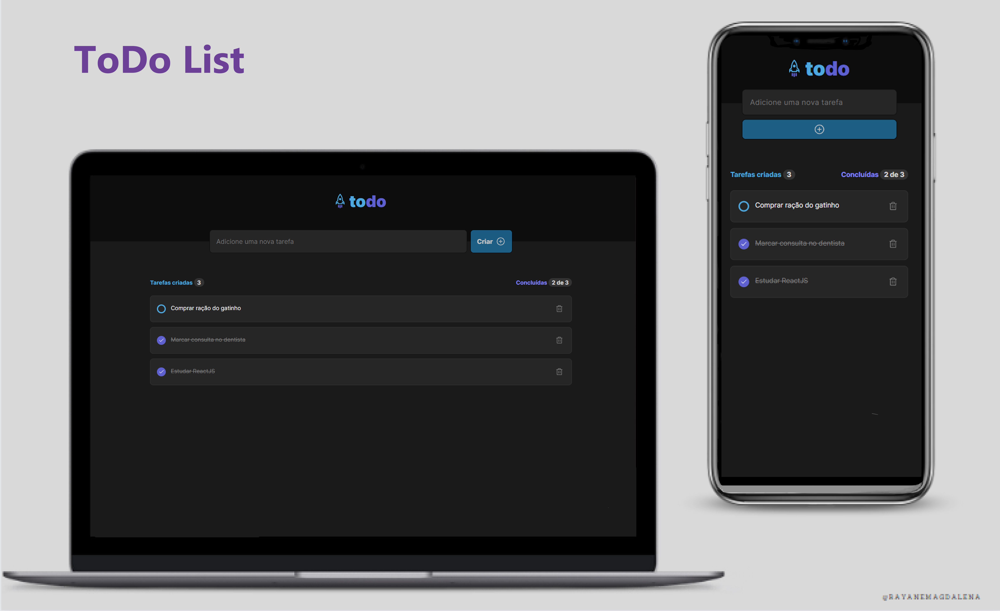

<h1 align="center"> Lista de Tarefas em React </h1>

&nbsp;&nbsp;&nbsp;|&nbsp;&nbsp;&nbsp; <a href="#sobre">Sobre</a> &nbsp;&nbsp;&nbsp;|&nbsp;&nbsp;&nbsp;
<a href="#tecnologias-utilizadas">Tecnologias Utilizadas</a> &nbsp;&nbsp;&nbsp;|&nbsp;&nbsp;&nbsp;
<a href="#layout">Layout</a> &nbsp;&nbsp;&nbsp;|&nbsp;&nbsp;&nbsp;
 

 

  

<h4 align="center"> 
	 Status: Finalizado
</h4>

## Sobre
 

Primeiro desafio da trilha de ReactJS da [@rockeatseat](https://www.rocketseat.com.br/). 
A aplicação consiste em uma lista de tarefas interativa, onde os usuários podem adicionar, remover e marcar tarefas como concluídas.
 
 

<h3>Funcionalidades Principais:</h3>

- <b>Adicionar Tarefas:</b> O botão de criação de tarefa é habilitado apenas quando o usuário preenche o campo de entrada.

- <b>Remover Tarefas:</b> Ao deletar uma tarefa, a aplicação exibe um modal para confirmar a ação, garantindo uma experiência intuitiva para o usuário.

- <b>Marcação de Tarefas:</b> Os usuários podem marcar ou desmarcar as tarefas como concluídas.

<h3>Armazenamento Local:</h3>
A lista de tarefas é armazenada no LocalStorage do usuário. Isso significa que, mesmo após fechar a aplicação, ao retornar à página, a lista de tarefas estará preservada e pronta para uso.

Esta aplicação não só oferece funcionalidades essenciais para gerenciamento de tarefas, mas também garante uma experiência contínua ao reter os dados localmente.

- [Acesse o projeto em execução aqui!](https://to-do-omega-dun.vercel.app/)

 

## Tecnologias Utilizadas
 

-   React

-  JavaScript

-  TypeScript

-  GIT

-  GitHub

-  Figma
 
 

- [Phosphor icons](https://phosphoricons.com/)
- CSS Modules
 
 

## Layout

[Figma do projeto](https://www.figma.com/file/0n0zDN7zbzhRbaEO74Xesx/ToDo-List/duplicate) disponibilizado pela Rocketseat.

Layout - Desktop 
 
 

 
 

Layout - Mobile     

## Projeto desenvolvido por:

<a href="https://www.linkedin.com/in/rayane-magdalena-473b83163/">
 

 <b>Rayane Magdalena</b></a> 
  

  

---			

 

  

